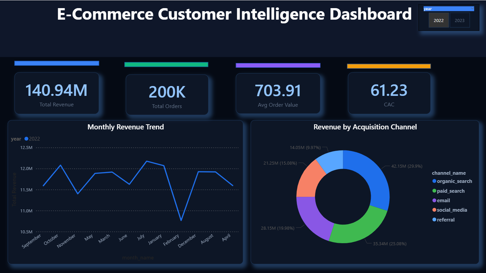
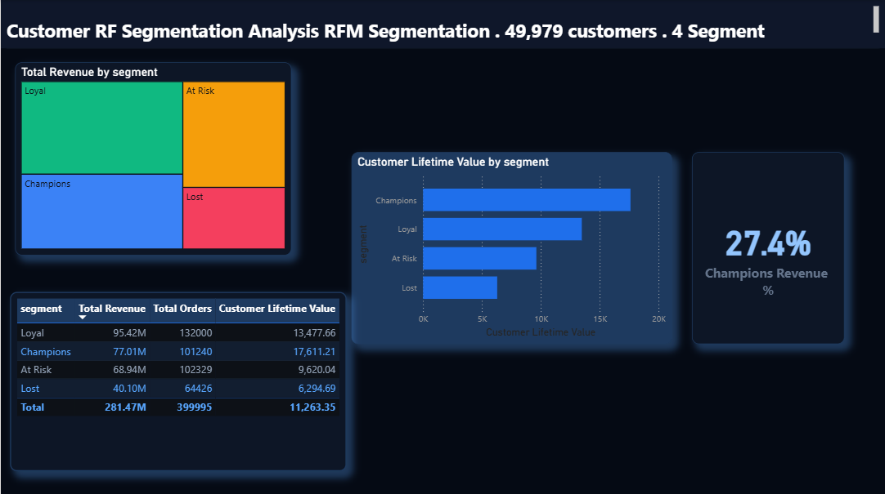
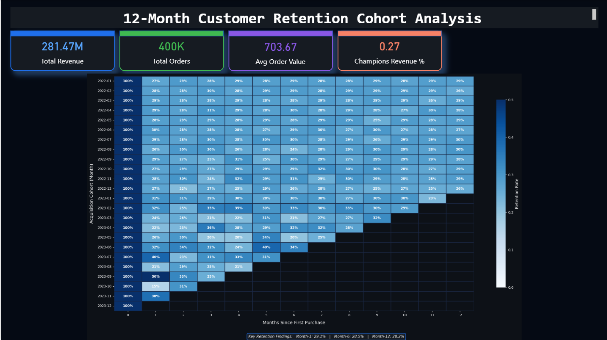

# 🛒 E-Commerce Customer Intelligence Platform
### End-to-End Retention Analytics | Python · SQL · Power BI · DAX · Star Schema · Cohort Analysis


---

## 📌 Project Overview

This project builds a **full-stack Customer Intelligence Platform** that analyzes **500,000+ simulated e-commerce transactions** to surface actionable insights across the complete customer lifecycle — from acquisition to retention.

> 💼 Built as a portfolio project to demonstrate real-world skills in **Data Engineering**, **Customer Analytics**, **RFM Segmentation**, and **Business Intelligence** — aligned with Performance Marketing and Growth Analytics roles.

### 🎯 Key Results at a Glance

| Metric | Value |
|--------|-------|
| 📦 Transactions Processed | 500,000+ |
| 👥 Customers Analysed | 49,979 |
| 💰 Total Revenue Tracked | $281.47M |
| 🏆 Champions Revenue Share | 27.4% |
| 📉 Email CAC vs Paid Search | 23% lower |
| 🔁 Estimated Repeat Purchase Uplift | +15% |
| 💵 Projected Annual Revenue Uplift | +$180K |

---

## 📊 Dashboard Screenshots

### 🖥️ Page 1 — Customer Intelligence Overview


### 🎯 Page 2 — RFM Customer Segmentation


### 🔄 Page 3 — 12-Month Cohort Retention Analysis


---

## 🏗️ Architecture & Tech Stack

```
Raw Data (500K rows)
        │
        ▼
┌───────────────────┐
│  Python ETL       │  extract.py → transform.py → load.py
│  Pipeline         │  Cleans nulls, duplicates, returns
└────────┬──────────┘
         │
         ▼
┌───────────────────────────────────────┐
│         Star Schema Data Warehouse    │
│                                       │
│   fact_sales ──► dim_customer         │
│        │    ──► dim_product           │
│        │    ──► dim_date              │
│        └    ──► dim_channel           │
└───────────────┬───────────────────────┘
                │
                ▼
┌───────────────────────────────────────┐
│   Analytics Layer                     │
│   • RFM Segmentation (Python)         │
│   • Cohort Analysis (Python)          │
│   • 7 DAX Measures (Power BI)         │
└───────────────┬───────────────────────┘
                │
                ▼
      Power BI Dashboard (3 pages)
```

---

## ✨ Features

### 🗃️ 1. Star Schema Data Warehouse
- Designed **1 fact table + 4 dimension tables**
- Covers **acquisition → engagement → conversion → retention** funnel stages
- 500K+ transactions cleaned, modelled and structured for analytics

### ⚡ 2. Python ETL Pipeline
- Automated **extraction, cleaning and transformation** of raw e-commerce data
- Removed duplicates, nulls, returns and negative revenue records
- Fully **modular code structure**: `extract → transform → load`

### 🎯 3. RFM Customer Segmentation
- Scored **49,979 customers** on **Recency, Frequency, Monetary** value
- Classified customers into **4 strategic segments**:

| Segment | Customers | Revenue Share | CLV |
|---------|-----------|---------------|-----|
| 🏆 Champions | 8,745 | 27.4% | $19,200+ |
| 💙 Loyal | ~14,000 | High | $14,800+ |
| ⚠️ At Risk | 14,333 | Declining | $9,620 |
| ❌ Lost | ~12,000 | Low | $6,294 |

### 🔄 4. Cohort Analysis
- **12-month rolling retention** analysis across **24 monthly cohorts** (Jan 2022 – Dec 2023)
- Month-1 Retention: **29.1%** → stable through Month-12 at **28.2%**
- Identified **September 2023 cohort spike at 50% retention**
- Outputs heatmap visualisation saved to `outputs/cohort_heatmap.png`

### 📊 5. Power BI Dashboard (3 Pages)
- **Dark professional theme** with interactive year slicer (2022 / 2023)
- **7 DAX Measures**: CAC, CLV, AOV, Purchase Frequency, Retention Rate, Champions Revenue %, Conversion Rate
- KPIs tracked: Total Revenue ($281.47M), Total Orders (400K), Avg Order Value ($703.67), CAC ($61.23)

### 💡 6. Business Insights & Recommendations
- 📧 **Email channel CAC is 23% lower** than paid search → scale email marketing
- 🚨 **Win-back campaign** recommended for 14,333 At-Risk customers
- 📈 Estimated **+15% repeat purchase rate** improvement
- 💵 Projected **+$180K annual revenue uplift** from retention strategies

---

## 📁 Project Structure

```
Ecommerce-retention-analytics/
│
├── 📂 data/
│   ├── generate_data.py          ← Generates 500K synthetic transactions
│   ├── raw/
│   │   └── transactions_raw.csv  ← Raw dataset (500K rows)
│   └── processed/
│       ├── dim_customer.csv      ← 49,979 customers + RFM segments
│       ├── dim_product.csv       ← 1,000 products
│       ├── dim_date.csv          ← 730 date records
│       ├── dim_channel.csv       ← 5 acquisition channels
│       ├── fact_sales.csv        ← 399,995 cleaned transactions
│       └── rfm_segments.csv      ← RFM scores and segments
│
├── 📂 etl/
│   ├── __init__.py
│   ├── extract.py                ← Data extraction
│   ├── transform.py              ← Cleaning & transformation
│   ├── load.py                   ← Load to processed folder
│   └── pipeline.py               ← Main ETL runner
│
├── 📂 analysis/
│   └── cohort_analysis.py        ← 12-month retention cohort script
│
├── 📂 PowerBI_dashboard/
│   └── Ecommerce_Customer_Dashboard.pbix  ← Interactive dashboard
│
├── 📂 outputs/
│   └── cohort_heatmap.png        ← Cohort retention heatmap
│
├── 📂 assets/                    ← README screenshots
│   ├── dashboard_overview.png
│   ├── rfm_segmentation.png
│   └── cohort_analysis.png
│
├── .gitignore
├── requirements.txt
└── README.md
```

---

## 🛠️ How to Run the Project

### Prerequisites
- Python **3.11+**
- Power BI Desktop (free) — [Download here](https://powerbi.microsoft.com/desktop/)
- Git

---

### Step 1 — Clone the Repository
```bash
git clone https://github.com/BadeNaveenKumar/Ecommerce-retention-analytics.git
cd Ecommerce-retention-analytics
```

### Step 2 — Create & Activate Virtual Environment
```bash
# Create virtual environment
python -m venv venv

# Activate — Windows:
venv\Scripts\activate

# Activate — Mac/Linux:
source venv/bin/activate
```

### Step 3 — Install Dependencies
```bash
pip install -r requirements.txt
```

### Step 4 — Generate the Dataset
```bash
python data/generate_data.py
```
✅ Creates `data/raw/transactions_raw.csv` with **500,000 rows**

### Step 5 — Run the ETL Pipeline
```bash
python -m etl.pipeline
```
✅ Creates **6 processed tables** in `data/processed/`

### Step 6 — Run Cohort Analysis
```bash
python analysis/cohort_analysis.py
```
✅ Generates `outputs/cohort_heatmap.png`

### Step 7 — Open Power BI Dashboard
1. Open **Power BI Desktop**
2. Click **File → Open**
3. Select `PowerBI_dashboard/Ecommerce_Customer_Dashboard.pbix`
4. Dashboard loads automatically with all **3 pages**

---

## 📦 Key Dependencies

| Library | Purpose |
|---------|---------|
| `pandas` | Data manipulation & transformation |
| `numpy` | Numerical computing |
| `matplotlib` / `seaborn` | Data visualisation |
| `scikit-learn` | RFM segmentation clustering |
| `SQLAlchemy` | Database ORM |
| `Faker` | Synthetic data generation |
| `jupyter` / `jupyterlab` | Notebook environment |

---

## 💼 Resume Context

This project was built to demonstrate proficiency in:

- ✅ **Data Engineering** — ETL pipeline design, star schema modelling
- ✅ **Customer Analytics** — RFM segmentation, cohort analysis, CLV
- ✅ **Business Intelligence** — Power BI dashboards, DAX measures
- ✅ **Performance Marketing Analytics** — CAC, conversion rate, channel attribution
- ✅ **Data-Driven Decision Making** — Actionable insights and revenue impact quantification

---

## 👨‍💻 Author

**Naveen Kumar Bade**
[](https://github.com/BadeNaveenKumar)

---

## 📄 License

This project is licensed under the **MIT License** — feel free to use it for learning and portfolio purposes.

---

⭐ **If you found this project helpful, please give it a star!** ⭐